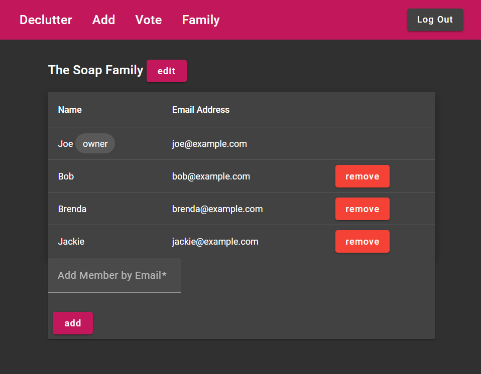
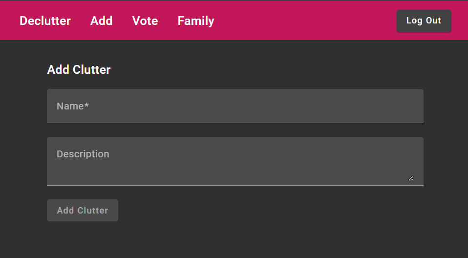
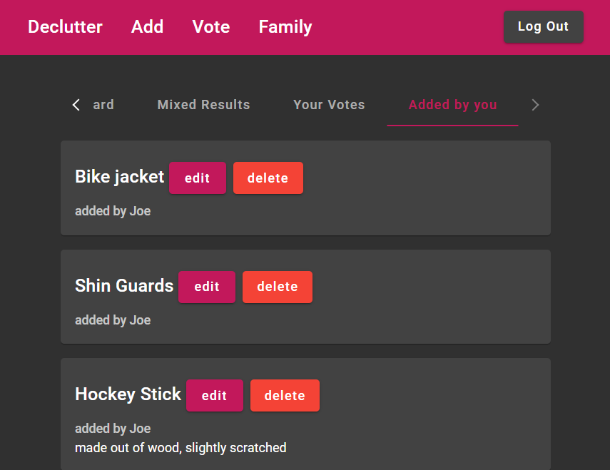
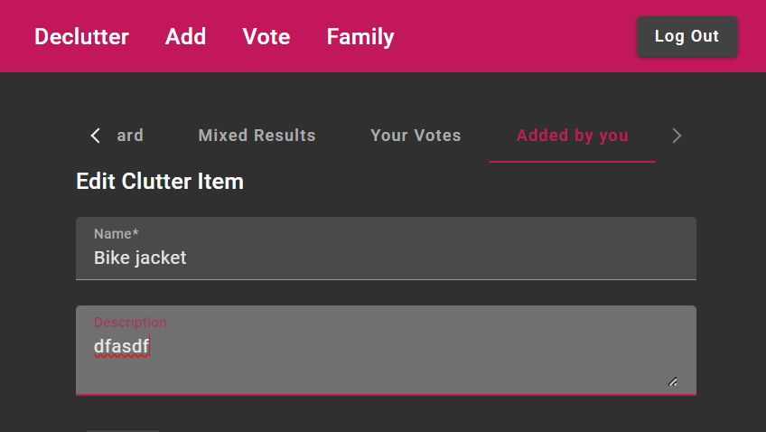
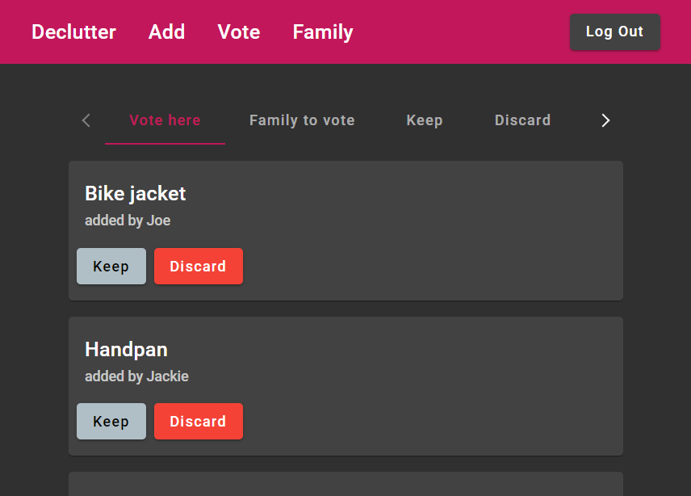
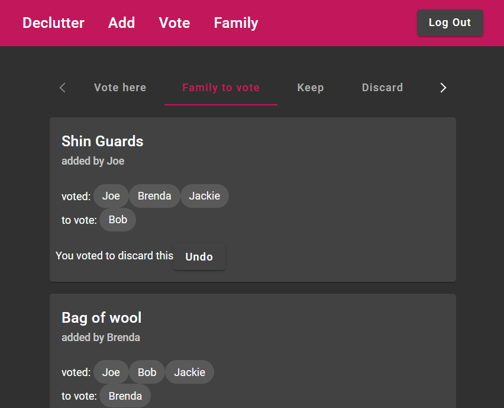
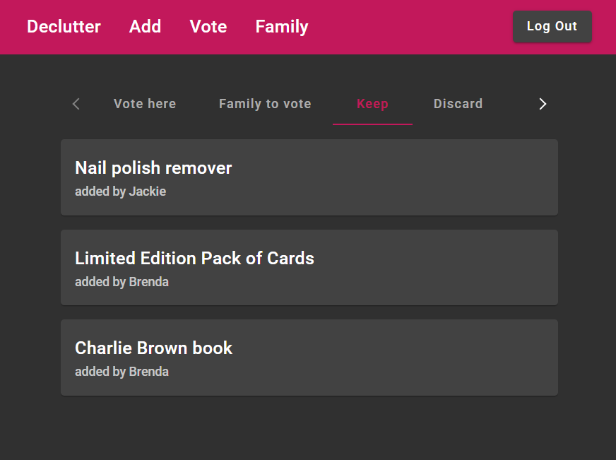
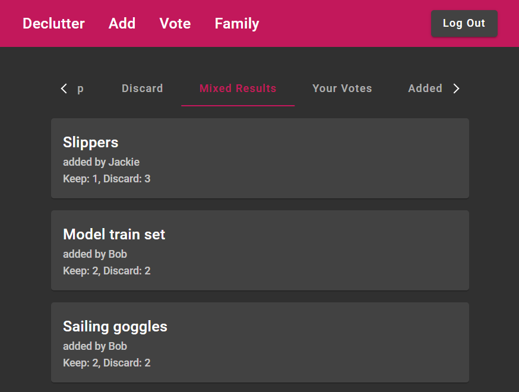
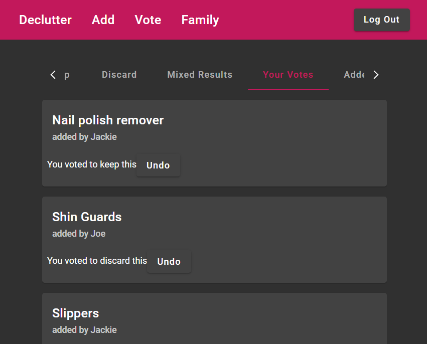

# DeclutterApp

A simple MEAN stack app for managing clutter.

Provides a platform where you and your family add items of clutter and vote on whether to keep or discard each item.

- Mongoose/MongoDB,
- Express,
- Angular
- Node

## Features

- Register
- Login
- Add/edit family
- Add/remove users to/from family
- Add/edit/delete clutter
- Vote on clutter (keep/discard)
- Check to see who else needs to vote on pending items
- See unanimous votes (everyone keep/discard)
- See mixed results and vote counts per item
- Undo your votes

## Todo

- auto logout when token expires
- short polling for live feed on clutter status
- include images

### Manage your family:

### Add your clutter:

### Manage and edit your clutter:

### Vote:

### See who still needs to vote:

### See what everyone's voted to keep

### See mixed results, where everyone's voted but not unanimously

### See your votes

